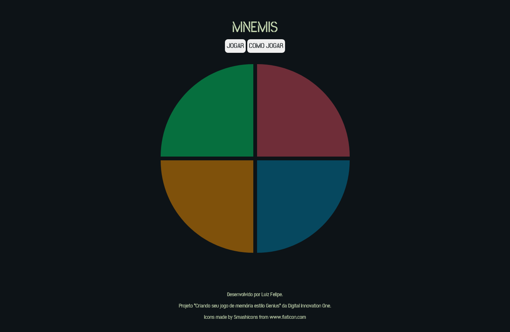
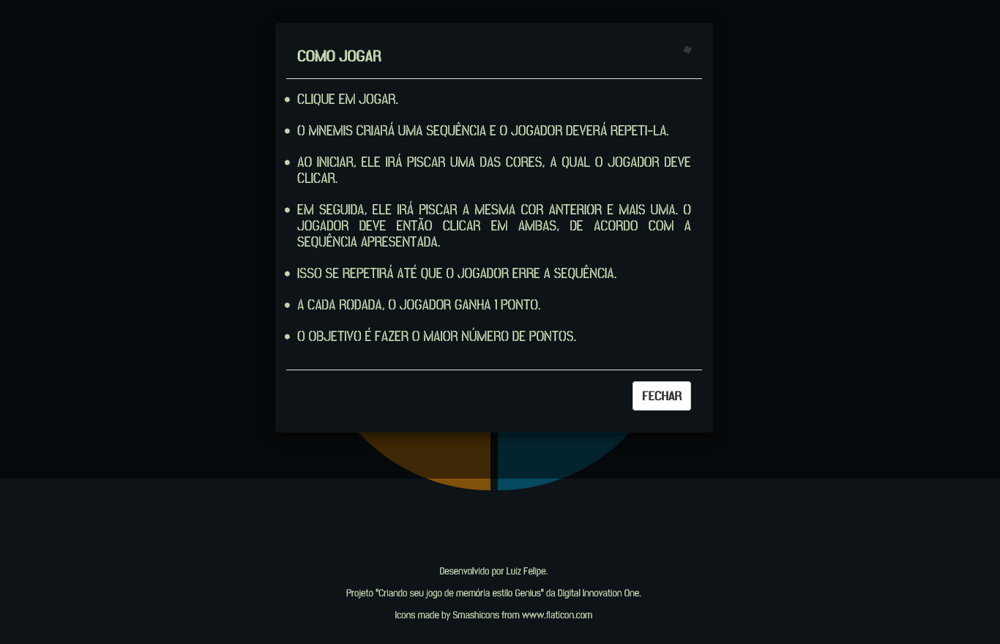
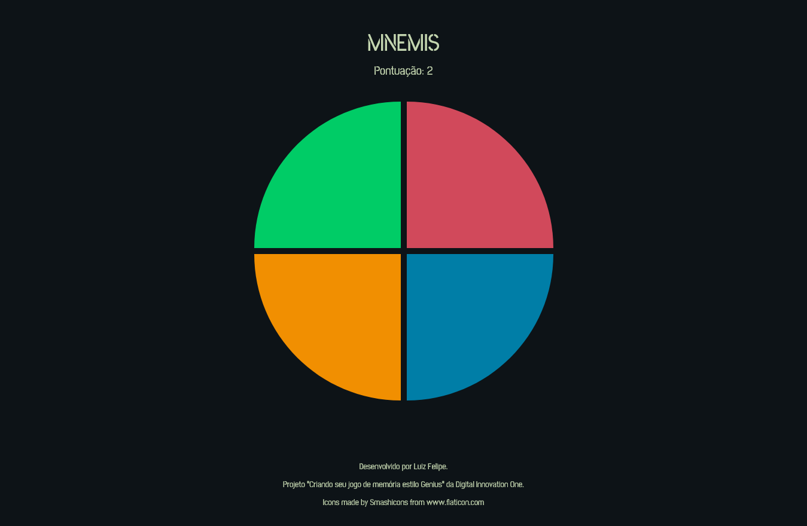

# MNEMIS

Reprodução do clássico jogo da memória "Genius", muito popular no Brasil durante a década de 1980, tendo sido distribuído pela Brinquedos Estrela e baseado no americano "Simon" da Hasbro.

O objetivo do jogo é memorizar e acertar a maior sequência possível de cores, sem errar.

Esta aplicação foi desenvolvida para o desafio "Criando seu jogo de memória estilo Genius" da [Digital Innovation One](https://web.digitalinnovation.one/home).

Clique [aqui](https://lufesipe.github.io/mnemis-game/) para jogar!

## Sumário

- [Visão Geral](#visão-geral)
  - [O Desafio](#o-desafio)
  - [Screenshots](#screenshots)
- [Desenvolvimento](#desenvolvimento)
  - [Ferramentas utilizadas](#ferramentas-utilizadas)
  - [Lições aprendidas](#lições-aprendidas)
  - [Melhorias futuras](#melhorias-futuras)
  - [Recursos úteis](#recursos-úteis)
- [O Autor](#o-autor)


## Visão Geral

### O Desafio

A proposta do projeto era a construção de um jogo da memória baseado no brinquedo [Genius](https://pt.wikipedia.org/wiki/Genius_(jogo)), utilizando HTML, CSS e JavaScript.


### Screenshots

Abaixo há algumas screenshots da aplicação criada.

A primeira mostra a página logo ao ser acessada, onde temos as opções de clicar nos botões "Jogar", para iniciar o jogo, e ler as instruções em "Como jogar". Neste momento, as cores do jogo se apresentam em um tom mais escuro, indicando que o mesmo está desativado.



<center>Visualização inicial da página</center>

A segunda screenshot apresenta o que ocorre ao selecionar o botão "Como jogar". Uma modal aparece na tela, contendo um texto com as instruções.



<center>Visualização ao clicar em "Como jogar"</center>

Finalmente,  ao clicar em jogar, as cores do jogo "acendem", os botões somem e dão lugar ao placar que conta os pontos e as sequências começam a ser apresentadas para o jogador.



<center>Visualização ao jogar</center>

## Desenvolvimento

### Ferramentas utilizadas

Para execução do projeto foi utilizado [HTML](https://developer.mozilla.org/pt-BR/docs/Web/HTML), [CSS](https://developer.mozilla.org/pt-BR/docs/Web/CSS) e [JavaScript](https://developer.mozilla.org/pt-BR/docs/Web/JavaScript) puro. Além disso, para a construção do modal, foi utilizado o framework [Bootstrap](https://getbootstrap.com/docs/4.0/components/modal/).

### Descrição

Iniciei este projeto seguindo as instruções da professora [Gabriela Pinheiro](https://github.com/SpruceGabriela), primeiramente construindo a página, estilizando e depois escrevendo os scripts do jogo. 

Após isto, optei por implementar algumas melhorias como o desligamento do jogo, que fiz criando a função notStarted, que adiciona a classe "is-over" na section de cada cor, e adicionando um condicional que bloqueia a execução da função click, responsável por receber os cliques do jogador.

Também decidi implementar a pontuação constante na tela, para que o jogador possa acompanhar seu desempenho, e os botões para iniciar o jogo e ler as instruções, estas mostradas através de um modal feito com Bootstrap.

Neste projeto também optei por utilizar algumas boas práticas de CSS, sendo elas o uso da metodologia BEM, para nomenclatura das classes, e de variáveis para guardar alguns valores globais do estilo, como pode ser visto abaixo:

```
:root {
  --background-color: #0d1317;
  --light-color: #c4d6b0;
  --dark-color: #697564;
  --blue-mnemis: #007ea7;
  --yellow-mnemis: #f18f01;
  --red-mnemis: #d1495b;
  --green-mnemis: #00cc66;
}
```


### Melhorias futuras

- Adicionar responsividade à aplicação
- Adicionar uma animação de carregamento entre os níveis
- Adicionar sons ao jogo
- Implementar o aviso de game over sem utilizar o alert


### Recursos úteis

Além das documentações específicas de cada item, os seguintes recursos tiveram grande contribuição.

[BEM Methodology](http://getbem.com/) - documentação sobre a metodologia BEM

[Bootstrap Modal](https://www.devmedia.com.br/bootstrap-modal-como-utilizar-em-seus-projetos/37426) - tutorial sobre a utilização do Bootstrap Modal

[StackOverflow](https://stackoverflow.com/) - que me ajudou a resolver algumas questões específicas.


## O Autor

Projeto desenvolvido por Luiz Felipe, abaixo deixo meu Github com alguns projetos que realizei, meu LinkedIn e contato.

Github - [lufesipe](https://github.com/lufesipe)

LinkedIn - [Luiz Felipe](www.linkedin.com/in/luiz-felipe-sp)

Email - [luizfspereira@outlook.com](mailto:luizfspereira@outlook.com)
